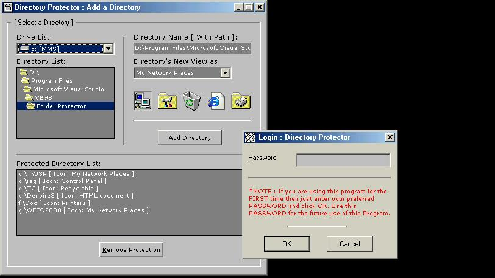



## Directory Protector

### Description

This is a nice tiny utility program for a beginner of Visual Basic…!

With this program one can lock his folder with password! Mainly this program changes a folder to a system folder like Control Panel or Recycle bin or Printer. It can also make a folder to HTML Document.

Try it, It's simple, easy and I wrote it for beginners so, there is no Hard code! If any beginner of VB has any problem to understand it, just email me.

Don't Forget To SEE SCREEN SHOT!

Thank you. 

<a href="mailto:mahatabur@yahoo.com">Mahatab-ur-Rashid</a>
 
### More Info
 

             |
---                |---
**Submitted On**   |2002-01-18 01:43:24
**By**             |[Mahatab\-ur\-Rashid](https://github.com/Planet-Source-Code/PSCIndex/blob/master/ByAuthor/mahatab-ur-rashid.md)
**Level**          |Beginner
**User Rating**    |4.8 (62 globes from 13 users)
**Compatibility**  |VB 3\.0, VB 4\.0 \(16\-bit\), VB 4\.0 \(32\-bit\), VB 5\.0, VB 6\.0
**Category**       |[Complete Applications](https://github.com/Planet-Source-Code/PSCIndex/blob/master/ByCategory/complete-applications__1-27.md)
**World**          |[Visual Basic](https://github.com/Planet-Source-Code/PSCIndex/blob/master/ByWorld/visual-basic.md)
**Archive File**   |[Directory\_46254142002\.zip](https://github.com/Planet-Source-Code/mahatab-ur-rashid-directory-protector__1-30388/archive/master.zip)

